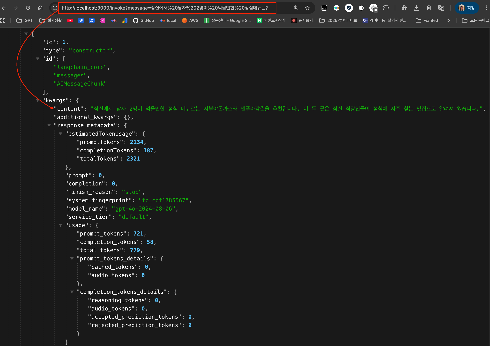

# LangGraph Agentic RAG 튜토리얼

이 튜토리얼은 LangGraph.js를 사용하여 에이전트 기반의 RAG(Retrieval-Augmented Generation) 애플리케이션을 단계별로 구축하는 과정을 안내합니다. 이 에이전트는 잠실 지역의 맛집에 대한 질문에 답변할 수 있습니다.

## 1단계: 의존성 설치

먼저, 프로젝트에 필요한 모든 라이브러리를 설치합니다. 터미널에서 다음 명령어를 실행하여 필요한 모든 패키지를 한 번에 설치합니다.

- **중요:** `dotenv` 최신 버전이 아니라 16버전을 설치해야 함.
  - 17 버전과 @langchain/langgraph 충돌이 있음.

```bash
npm install @langchain/community @langchain/core @langchain/google-genai @langchain/langgraph @langchain/openai @langchain/textsplitters cheerio dotenv@16 dotenv-flow langchain ts-node typescript zod zod-to-json-schema
```

이 명령어는 `package.json` 파일에 필요한 모든 의존성을 자동으로 추가하고 설치합니다.

## 2단계: 환경 변수 설정

프로젝트 루트 디렉토리에 `.env` 파일을 생성하고 OpenAI API 키를 추가합니다.

```
OPENAI_API_KEY="여기에_당신의_API_키를_입력하세요"
```

## 3단계: 프로젝트 구조 생성

`src` 폴더와 그 안에 `agent` 폴더를 생성합니다. 최종적인 구조는 다음과 같습니다.

```
/
├── src/
│   ├── agent/
│   └── index.ts
├── .env
├── package.json
└── ...
```

## 4단계: `package.json` 스크립트 추가

`package.json` 파일의 `scripts` 섹션에 애플리케이션을 실행하기 위한 `dev` 스크립트를 추가합니다.

```json
{
  "scripts": {
    "dev": "ts-node src/index.ts"
  }
}
```

## 5단계: Retriever 및 Tool 파일 생성

### `src/agent/retriever.ts`

웹에서 블로그 게시물을 가져와 문서를 분할하고 벡터 저장소에 저장하는 리트리버를 설정합니다.

```typescript
import { CheerioWebBaseLoader } from "@langchain/community/document_loaders/web/cheerio";
import { RecursiveCharacterTextSplitter } from "@langchain/textsplitters";
import { MemoryVectorStore } from "langchain/vectorstores/memory";
import { OpenAIEmbeddings } from "@langchain/openai";
import dotenvFlow from "dotenv-flow";

dotenvFlow.config();

const urls = [
  "https://blog.naver.com/ban__di/223783862789",
  "https://lazyyellow.tistory.com/87",
  "https://funktionalflow.com/%EC%9E%A0%EC%8B%A4-%EB%A7%9B%EC%A7%91/",
];

const docs = await Promise.all(
  urls.map((url) => new CheerioWebBaseLoader(url).load())
);
const docsList = docs.flat();

const textSplitter = new RecursiveCharacterTextSplitter({
  chunkSize: 500,
  chunkOverlap: 50,
});
const docSplits = await textSplitter.splitDocuments(docsList);

const vectorStore = await MemoryVectorStore.fromDocuments(
  docSplits,
  new OpenAIEmbeddings()
);

export const retriever = vectorStore.asRetriever();
```

### `src/agent/tool.ts`

리트리버를 사용하여 정보를 검색하는 도구를 생성합니다.

```typescript
import { createRetrieverTool } from "langchain/tools/retriever";
import { ToolNode } from "@langchain/langgraph/prebuilt";
import { retriever } from "./retriever.ts";
import type { GraphState } from "./state.ts";

const tool = createRetrieverTool(retriever, {
  name: "retrieve_blog_posts",
  description:
    "송파구 잠실 및 잠실역 근처 점심 맛집 게시물을 검색하고 정보를 반환합니다.",
});

export const tools = [tool];

export const toolNode = new ToolNode<typeof GraphState.State>(tools);
```

## 6단계: State, Edge, Graph 파일 생성

### `src/agent/state.ts`

그래프의 상태를 정의합니다. 이 상태는 대화의 메시지들을 관리합니다.

```typescript
import { Annotation } from "@langchain/langgraph";
import { BaseMessage } from "@langchain/core/messages";

export const GraphState = Annotation.Root({
  messages: Annotation<BaseMessage[]>({
    reducer: (x, y) => x.concat(y),
    default: () => [],
  }),
});
```

### `src/agent/edge.ts`

그래프의 노드(동작)와 엣지(흐름 제어) 로직을 구현합니다.

```typescript
import { END } from "@langchain/langgraph";
import { pull } from "langchain/hub";
import { z } from "zod";
import { ChatPromptTemplate } from "@langchain/core/prompts";
import { ChatOpenAI } from "@langchain/openai";
import { AIMessage } from "@langchain/core/messages";
import { tools } from "./tool.ts";
import type { GraphState } from "./state.ts";

export function shouldRetrieve(state: typeof GraphState.State): string {
  const { messages } = state;
  console.log("---검색 여부 결정---");
  const lastMessage = messages[messages.length - 1];

  if (
    "tool_calls" in lastMessage &&
    Array.isArray(lastMessage.tool_calls) &&
    lastMessage.tool_calls.length
  ) {
    console.log("---결정: 검색 진행---");
    return "retrieve";
  }

  return END;
}

export async function gradeDocuments(
  state: typeof GraphState.State
): Promise<Partial<typeof GraphState.State>> {
  console.log("---관련성 평가---");

  const { messages } = state;
  const tool = {
    name: "give_relevance_score",
    description: "검색된 문서에 관련성 점수를 부여합니다.",
    schema: z.object({
      binaryScore: z.string().describe("관련성 점수 'yes' 또는 'no'"),
    }),
  };

  const prompt = ChatPromptTemplate.fromTemplate(
    `당신은 검색된 문서가 사용자 질문과 관련이 있는지 평가하는 채점자입니다.
  다음은 검색된 문서입니다:
  
 ------- 

  {context}
  
 ------- 

  다음은 사용자 질문입니다: {question}
  문서의 내용이 사용자 질문과 관련이 있으면 관련 있음으로 평가하세요.
  문서가 질문과 관련이 있는지 나타내는 'yes' 또는 'no'의 이진 점수를 부여하세요.
  Yes: 문서가 질문과 관련이 있습니다.
  No: 문서가 질문과 관련이 없습니다.`
  );

  const model = new ChatOpenAI({
    model: "gpt-4o",
    temperature: 0,
  }).bindTools([tool], {
    tool_choice: tool.name,
  });

  const chain = prompt.pipe(model);

  const lastMessage = messages[messages.length - 1];

  const score = await chain.invoke({
    question: messages[0].content as string,
    context: lastMessage.content as string,
  });

  return {
    messages: [score],
  };
}

export function checkRelevance(state: typeof GraphState.State): string {
  console.log("---관련성 확인---");

  const { messages } = state;
  const lastMessage = messages[messages.length - 1];
  if (!("tool_calls" in lastMessage)) {
    throw new Error(
      "'checkRelevance' 노드는 가장 최근 메시지에 도구 호출이 포함되어야 합니다."
    );
  }
  const toolCalls = (lastMessage as AIMessage).tool_calls;
  if (!toolCalls || !toolCalls.length) {
    throw new Error("마지막 메시지가 함수 메시지가 아닙니다");
  }

  if (toolCalls[0].args.binaryScore === "yes") {
    console.log("---결정: 문서 관련 있음---");
    return "yes";
  }
  console.log("---결정: 문서 관련 없음---");
  return "no";
}

export async function agent(
  state: typeof GraphState.State
): Promise<Partial<typeof GraphState.State>> {
  console.log("---에이전트 호출---");

  const { messages } = state;
  const filteredMessages = messages.filter((message) => {
    if (
      "tool_calls" in message &&
      Array.isArray(message.tool_calls) &&
      message.tool_calls.length > 0
    ) {
      return message.tool_calls[0].name !== "give_relevance_score";
    }
    return true;
  });

  const model = new ChatOpenAI({
    model: "gpt-4o",
    temperature: 0,
    streaming: true,
  }).bindTools(tools);

  const response = await model.invoke(filteredMessages);
  return {
    messages: [response],
  };
}

export async function rewrite(
  state: typeof GraphState.State
): Promise<Partial<typeof GraphState.State>> {
  console.log("---쿼리 변환---");

  const { messages } = state;
  const question = messages[0].content as string;
  const prompt = ChatPromptTemplate.fromTemplate(
    `입력을 보고 기본적인 의미나 의도를 파악해보세요. 

다음은 초기 질문입니다:

 ------- 

{question}

 ------- 

개선된 질문을 작성하세요:`
  );

  const model = new ChatOpenAI({
    model: "gpt-4o",
    temperature: 0,
    streaming: true,
  });
  const response = await prompt.pipe(model).invoke({ question });
  return {
    messages: [response],
  };
}

export async function generate(
  state: typeof GraphState.State
): Promise<Partial<typeof GraphState.State>> {
  console.log("---답변 생성---");

  const { messages } = state;
  const question = messages[0].content as string;
  const lastToolMessage = messages
    .slice()
    .reverse()
    .find((msg) => msg._getType() === "tool");
  if (!lastToolMessage) {
    throw new Error("대화 기록에서 도구 메시지를 찾을 수 없습니다");
  }

  const docs = lastToolMessage.content as string;

  const prompt = await pull<ChatPromptTemplate>("rlm/rag-prompt");

  const llm = new ChatOpenAI({
    model: "gpt-4o",
    temperature: 0,
    streaming: true,
  });

  const ragChain = prompt.pipe(llm);

  const response = await ragChain.invoke({
    context: docs,
    question,
  });

  return {
    messages: [response],
  };
}
```

### `src/agent/graph.ts`

StateGraph를 사용하여 에이전트의 워크플로우를 정의합니다.

```typescript
import { StateGraph, START, END } from "@langchain/langgraph";
import {
  agent,
  gradeDocuments,
  rewrite,
  generate,
  shouldRetrieve,
  checkRelevance,
} from "./edge.ts";
import { toolNode } from "./tool.ts";
import { GraphState } from "./state.ts";

const builder = new StateGraph(GraphState)
  .addNode("agent", agent)
  .addNode("retrieve", toolNode)
  .addNode("gradeDocuments", gradeDocuments)
  .addNode("rewrite", rewrite)
  .addNode("generate", generate);

builder.addEdge(START, "agent");

builder.addConditionalEdges("agent", shouldRetrieve);

builder.addEdge("retrieve", "gradeDocuments");

builder.addConditionalEdges("gradeDocuments", checkRelevance, {
  yes: "generate",
  no: "rewrite",
});

builder.addEdge("generate", END);
builder.addEdge("rewrite", "agent");

export const graph = builder.compile();
```

## 7단계: `index.ts`에 코드 추가

애플리케이션의 진입점인 `src/index.ts` 파일에 다음 코드를 추가하여 그래프를 실행하고 결과를 출력합니다.

```typescript
import { HumanMessage } from "@langchain/core/messages";
import { graph } from "./agent/graph.ts";

const message = "남자들이 좋아할만한 점심 메뉴는?";

const initialState = {
  messages: [new HumanMessage(message)],
};

const result = await graph.invoke(initialState);

console.log(result);
```

## 8단계: 애플리케이션 실행

모든 설정이 완료되었습니다. 터미널에서 다음 명령어를 실행하여 에이전트를 실행합니다.

```bash
npm run dev
```

이제 에이전트가 사용자의 질문에 답변하기 위해 문서를 검색하고, 관련성을 평가하며, 필요한 경우 질문을 다시 작성하고, 최종적으로 답변을 생성하는 과정을 볼 수 있습니다.

## 부록 9단계: Express 서버를 올려서 API로 만들어보자.

지금까지 만든 RAG 에이전트를 Express.js를 사용하여 웹 서비스로 만들어 보겠습니다. 이렇게 하면 외부에서 HTTP 요청을 통해 에이전트와 상호작용할 수 있습니다.

### Express 설치

먼저, Express와 TypeScript 타입을 설치합니다.

```bash
npm install express @types/express
```

### `index.ts` 수정

기존 `src/index.ts` 파일의 내용을 다음 코드로 교체하여 Express 서버를 설정합니다.

```typescript
import express from "express";
import { graph } from "./agent/graph.ts";
import { HumanMessage } from "@langchain/core/messages";

const app = express();
const port = 3000;

app.use(express.json());

app.get("/invoke", async (req, res) => {
  const { message } = req.query as { message: string };

  if (!message) {
    return res.status(400).send({ error: "Message is required" });
  }

  const initialState = {
    messages: [new HumanMessage(message)],
  };

  try {
    const result = await graph.invoke(initialState);
    res.send(result);
  } catch (error) {
    console.error(error);
    res.status(500).send({ error: "An error occurred" });
  }
});

app.listen(port, () => {
  console.log(`Server is running on http://localhost:${port}`);
});
```

### 서버 실행 및 테스트

1.  **서버 실행**

    터미널에서 다음 명령어를 실행하여 Express 서버를 시작합니다.

    ```bash
    npm run dev
    ```

    서버가 정상적으로 시작되면 다음과 같은 메시지가 표시됩니다.

    ```
    Server is running on http://localhost:3000
    ```

2.  **API 테스트**

    웹 브라우저나 `curl`을 사용하여 GET 요청으로 에이전트에게 질문을 보낼 수 있습니다.

    **웹 브라우저:**

    주소창에 다음 URL을 입력합니다.

    ```
    http://localhost:3000/invoke?message=남자들이%20좋아할만한%20점심%20메뉴는?
    ```

    **curl:**

    터미널에서 다음 명령어를 실행합니다.

    ```bash
    curl "http://localhost:3000/invoke?message=남자들이%20좋아할만한%20점심%20메뉴는?"
    ```

    

이제 RAG 에이전트가 API 서비스로 동작하며 HTTP 요청에 응답하는 것을 확인할 수 있습니다.
