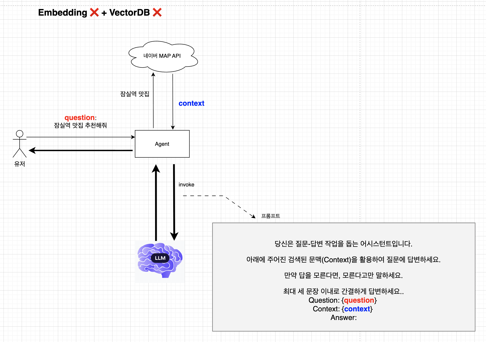
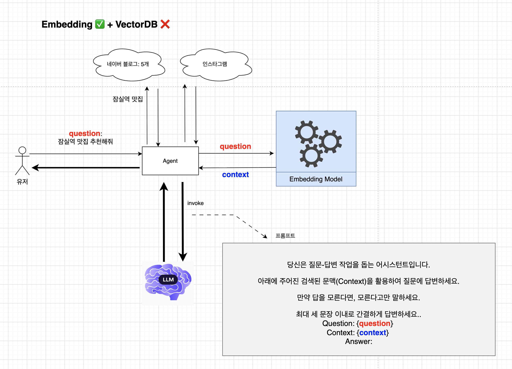

# 🤖 AI 스터디: '임베딩(Embedding)' 개념 완전 정복 🚀

'임베딩(Embedding)' 개념을 처음 접했을 때 큰 위기가 왔습니다. 😅
심화 과정이라 그런지, 그 오묘한 개념을 머릿속에 쏙 넣기까지 오랜 시간이 걸리더라구요.
하지만 걱정 마세요! 여러분은 저처럼 헤매지 않도록, 제가 겪었던 시행착오를 바탕으로 가장 쉽게 임베딩의 세계로 안내해 드릴게요. ✨

이 문서를 통해 여러분만큼은 임베딩이 무엇이고, 왜 중요하며, 어떻게 활용되는지
확실하게 이해하고 가셨으면 좋겠습니다!

---

**‘임베딩(Embedding)’** 개념에 대해 쉽게 공유해 보려고 합니다.

왜, **Embedding**, **VectorDB** 를 써야 하는지에 대해서

## 1. 임베딩(Embedding), 그게 뭔가요?

한마디로 정의하면, **"AI가 이해할 수 있도록 단어나 문장을 '숫자 목록(벡터)'으로 번역하는 기술"** 입니다.

컴퓨터는 '마라탕'이나 '해장국' 같은 텍스트(String)를 직접 이해하지 못합니다. 오직 숫자, 특히 **벡터(Vector)**와 **행렬(Matrix)**로만 세상을 이해하죠.

임베딩은 이 텍스트를 AI가 이해할 수 있는 숫자 좌표, 즉 **'의미의 좌표'**로 매핑(mapping)해주는 마법 같은 번역기입니다.

- "얼큰한 국물" (텍스트) ➡️ `[0.12, 0.78, -0.45, ...]` (벡터)

- "신선한 야채" (텍스트) ➡️ `[0.67, -0.11, 0.32, ...]` (벡터)

---

## 2. 가장 쉬운 비유: '의미의 지도' 🗺️

임베딩을 이해하는 가장 쉬운 방법은 **'의미의 지도'** 를 떠올리는 것입니다.

- 우리가 사용하는 모든 단어/문장을 '도시'라고 생각해봅시다.
- **임베딩(벡터)** 은 그 도시의 **'좌표'(예: 위도, 경도)** 입니다.

이 '의미의 지도'에는 아주 중요한 규칙이 있습니다.

"의미가 비슷한 단어(도시)는 서로 가까운 곳에 위치한다!"

- 가까운 단어들:

  > - `강아지`, `고양이`, `멍멍이` 벡터는 지도에서 서로 아주 가까이 붙어있을 겁니다. (모두 '반려동물' 카테고리)\

  > - `얼큰한`, `매운`, `칼칼한` 벡터도 서로 가까이 있겠죠.

- 먼 단어들:
  > - `강아지` 벡터와 `노트북` 벡터는 지도에서 아주 멀리 떨어져 있을 겁니다. (의미가 전혀 다름)

---

### 3. 임베딩이 '그냥' 숫자가 아닌 이유 (feat. 의미의 연산)

임베딩이 정말 강력한 이유는, 이 벡터(숫자)들이 단순한 ID가 아니라 '의미'를 담고 있기 때문입니다.

그래서 벡터끼리 **'연산'** 이 가능합니다. 가장 고전적이고 유명한 예시죠.

> `벡터(왕)` - `벡터(남자)` + `벡터(여자)` ≈ `벡터(여왕)`

이게 가능하다는 것은, 임베딩 모델이 '왕'과 '남자'의 관계(권력 + 남성)를 이미 벡터 좌표 안에 학습해뒀다는 뜻입니다.

이것을 우리 '점심 메뉴'에 대입해 볼까요?

> `벡터(제육덮밥)` - `벡터(돼지고기)` + `벡터(닭고기)` ≈ `벡터(닭갈비덮밥)`

이런 식의 '의미 연산'이 가능해지는 것이 바로 임베딩의 힘입니다.

---

## Embedding, VectorDB 필요 여부 판단

### Case 1: 소득세율 챗봇 - Embedding ✅, VectorDB ✅


```
소득세법.docx (100페이지)
├─ 1장: 과세 대상 소득
├─ 2장: 세율 구간
├─ 3장: 공제 항목
├─ 4장: 신고 방법
└─ ...

사용자: "5천만원 연봉일때 소득세는 얼마야?"

❌ 전체 문서를 LLM에 전달
   → 100페이지는 너무 많아 컨텍스트 초과

✅ Embedding + Vector DB 사용
   1. 문서를 청크로 나눠서 embedding
   2. 질문을 embedding으로 변환
   3. 관련 있는 "2장: 세율 구간" 부분만 검색
   4. 해당 부분만 LLM에 전달 → 답변 생성

💡 사용 상황:
- 데이터가 많음 (수천~수만 개)
- 데이터가 자주 바뀌지 않음
- 반복적으로 검색됨
- 영구 저장 필요
```

### Case 2: 맛집 챗봇 - Embedding ❌, VectorDB ❌



```
사용자: "잠실역 근처 맛집 알려줘"

지도 API 응답:
[
  {name: "김밥천국", location: "잠실역 1번 출구", rating: 4.2},
  {name: "스타벅스", location: "잠실역 지하", rating: 4.5},
  ...
]

✅ 바로 LLM에 전달
   LLM에게 전달:
   "다음 식당 리스트에서 추천해줘: [API 데이터]"
   → LLM이 이해하고 추천 생성


💡 사용 상황:
- 구조화된 데이터 (JSON, XML, 등등..)
- 데이터가 적음
- 정확한 필터링으로 충분
- 의미 검색 불필요

```

### Case 3: 맛집 챗봇 - Embedding ✅, VectorDB ❌



```
사용자: "잠실역 근처 맛집 알려줘"

1. 웹 크롤링 실행
   - 네이버 블로그 10개 글 수집
   - 인스타그램 리뷰 5개 수집
   - 맛집 블로그 3개 수집
   → 총 18개 문서 (비구조화된 텍스트 덩어리)

2. Embedding으로 벡터 변환 (즉시)
   각 문서 → [0.2, 0.8, ...] 벡터로 변환
   메모리에 저장

3. 사용자 질문도 Embedding
   "잠실역 근처 맛집" → [0.22, 0.78, ...] 벡터

4. In-Memory에서 유사도 계산
   18개 벡터와 질문 벡터를 비교
   가장 유사한 상위 3개 문서 선택

5. LLM에 전달하여 답변 생성


💡 사용 상황:
- 데이터가 일회성 (요청마다 새로 가져옴)
- 데이터가 적당히 적음 (수십~수백 개)
- 실시간성이 중요
- 영구 저장 불필요
```

---

## 4. 주요 임베딩 모델의 종류

임베딩 모델은 처리하는 데이터 타입에 따라 크게 세 가지로 나눌 수 있습니다.

### 📝 Text 임베딩 모델

텍스트를 벡터로 변환하는 가장 일반적인 임베딩 모델입니다.

**OpenAI (자체 모델 보유 ✅)**

- `text-embedding-3-large`: 가장 강력한 성능, 3,072차원
- `text-embedding-3-small`: 효율적이고 빠름, 1,536차원
- `text-embedding-ada-002`: 이전 세대 모델

**Anthropic/Claude (자체 모델 없음 ❌)**

- Claude는 임베딩 모델을 제공하지 않습니다
- Claude API를 사용하는 경우, 다른 임베딩 모델과 조합해서 사용해야 합니다

**기타 오픈소스 모델**

- `sentence-transformers`: Hugging Face의 인기 라이브러리
- `BAAI/bge-large-en`: 중국 BAAI의 고성능 모델
- `intfloat/e5-large-v2`: Microsoft의 오픈소스 모델
- `Cohere embed-v3`: Cohere의 다국어 임베딩

### 🖼️ Image 임베딩 모델

이미지를 벡터로 변환하여 유사 이미지 검색, 이미지 분류 등에 활용합니다.

**주요 모델**

- `CLIP (OpenAI)`: 텍스트와 이미지를 같은 벡터 공간에 매핑 (멀티모달)
- `ViT (Vision Transformer)`: Google의 이미지 전용 트랜스포머 모델
- `ResNet`: 전통적인 CNN 기반 이미지 임베딩
- `DINOv2 (Meta)`: Self-supervised learning 기반 최신 모델

**활용 사례**

- "이 옷과 비슷한 스타일 찾기"
- "이 음식 사진과 유사한 레시피 검색"
- 이미지 중복 탐지

### 💻 Code 임베딩 모델

소스 코드를 벡터로 변환하여 코드 검색, 유사 코드 탐지, 버그 패턴 분석 등에 사용합니다.

**주요 모델**

- `CodeBERT (Microsoft)`: 다양한 프로그래밍 언어 지원
- `GraphCodeBERT`: 코드의 구조(AST)까지 이해
- `StarCoder Embedding`: BigCode 프로젝트의 코드 임베딩
- `OpenAI text-embedding-3`: 텍스트 모델이지만 코드도 잘 처리함

**활용 사례**

- "이 함수와 비슷한 기능의 코드 찾기"
- "중복 코드 탐지"
- "버그 패턴 학습 및 예측"

**실제 서비스에서의 활용**

우리가 일상적으로 사용하는 AI 코딩 도구들도 내부적으로 Code Embedding을 활용하고 있을 가능성이 높습니다:

- **Cursor**
- **Claude Code**
- **Open AI (Codex)**
- **CodeRabbit**

이들 서비스는 수천~수만 개의 코드 파일 중에서 현재 작업과 관련된 코드만 빠르게 찾아내야 하는데, 이때 Code Embedding이 핵심 역할을 합니다.

> 💡 **Tip**: OpenAI는 범용 텍스트 임베딩 모델로 코드도 처리 가능하지만, 전문 코드 임베딩 모델은 프로그래밍 언어의 구문(syntax)과 의미(semantics)를 더 깊이 이해합니다. 실제 AI 코딩 도구들은 이러한 전문 모델을 사용하거나, 자체 개발한 코드 임베딩 시스템을 활용할 것으로 추측됩니다.
