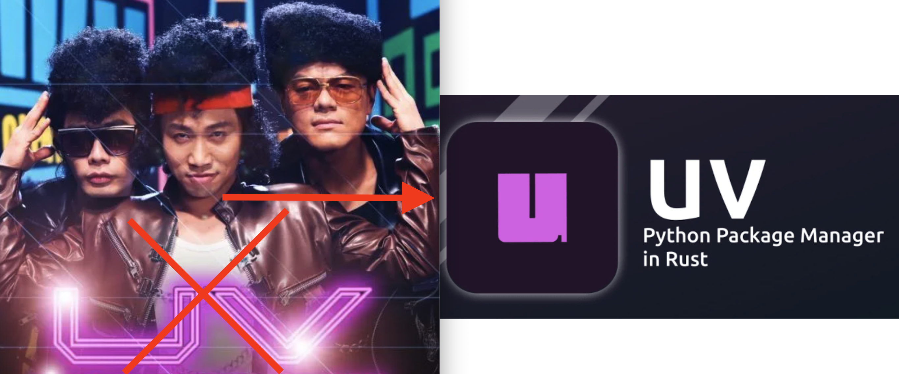

# UV를 이용한 Python 개발 환경 설정 가이드



Python 개발에 익숙하지 않은 개발자에게 강력하고 효율적인 개발 환경을 설정하는 것은 어려울 수 있습니다. 이 가이드는 Python 환경 관리를 간소화하고 일관성을 보장하며 생산성을 높이는 현대적이고 매우 빠른 도구인 `uv`를 소개합니다.

## UV를 선택해야 하는 이유

`uv`는 기존 Python 환경 도구에 비해 상당한 이점을 제공합니다:

### **손쉬운 Python 버전 관리**

Python 프로젝트는 종종 특정 Python 버전을 요구합니다. `uv`를 사용하면 각 프로젝트에 대해 다른 Python 버전을 쉽게 지정하고 관리하여 충돌을 방지하고 호환성을 보장할 수 있습니다.


### **결정론적 빌드**


`uv`는 직접 및 간접 종속성을 포함하여 설치된 모든 패키지의 정확한 버전을 기록하는 `uv.lock` 파일을 생성합니다. 이는 프로젝트가 어떤 머신에서든 정확히 동일한 패키지 버전으로 실행되도록 보장하여 "내 컴퓨터에서는 되는데" 문제를 없애고 원활한 협업을 촉진합니다.

### **압도적인 속도**


Rust로 구축된 `uv`는 매우 빠르며, 종종 `pip`보다 수십에서 수백 배 빠릅니다.
이 속도는 패키지 설치 및 환경 설정 중 대기 시간을 크게 줄여 개발 흐름을 원활하게 유지합니다.

---

## UV를 이용한 Python 개발환경 설정

### 1. UV 설치

`uv`는 다양한 운영 체제에서 사용할 수 있습니다. 시스템에 적합한 설치 방법을 선택하십시오.

#### Mac/Linux

Homebrew가 설치되어 있다면 (Mac 권장):

```bash
brew install uv
```

Homebrew를 사용할 수 없거나 다른 Linux 배포판의 경우, Google에서 "install uv"를 검색하여 다른 설치 방법을 찾을 수 있습니다. 일반적으로 `curl` 명령을 사용합니다.

#### 설치 확인

설치 후 `uv`가 올바르게 설치되었는지 버전을 확인하여 확인하십시오:

```bash
uv --version
```

터미널에 설치된 `uv` 버전이 출력되어야 합니다.

### 2. 새 Python 프로젝트 초기화

`uv`는 새 Python 프로젝트 구조를 빠르게 설정할 수 있습니다.

1.  **프로젝트 디렉토리 생성**:
    ```bash
    mkdir my-python-project
    cd my-python-project
    ```
2.  **`uv`로 프로젝트 초기화**:

    ```bash
    uv init
    ```

    이 명령은 `pyproject.toml` 및 기본 `main.py`와 같은 필수 프로젝트 파일을 생성합니다.

    **`pyproject.toml` 이해**: 이 파일은 Python 프로젝트의 현대적인 표준입니다. 프로젝트 메타데이터(이름, 버전, 설명)를 관리하고 프로젝트 종속성을 지정합니다.

### 3. Python 가상 환경 생성 및 활성화

가상 환경은 프로젝트의 종속성을 다른 Python 프로젝트 및 시스템의 전역 Python 설치와 격리합니다.

1.  **가상 환경 생성**:

    ```bash
    uv venv --python 3.13 # Python 버전 지정 가능 (예: 3.10, 3.12)
    ```

    지정된 Python 버전이 시스템에 설치되어 있지 않으면 `uv`가 자동으로 설치를 시도합니다. 이 명령은 프로젝트 내에 `.venv` 디렉토리를 생성합니다.

2.  **가상 환경 활성화**:

    - **Mac/Linux**:
      ```bash
      source .venv/bin/activate
      ```
    - **Windows**:
      ```bash
      .venv\Scripts\activate
      ```
      _(Windows 활성화 문제 해결: 오류가 발생하면 PowerShell을 관리자 권한으로 실행하고 `Set-ExecutionPolicy RemoteSigned`를 실행한 다음 `Y`를 입력하여 확인하십시오. 이렇게 하면 스크립트 실행이 허용됩니다.)_

    활성화되면 터미널 프롬프트에 일반적으로 가상 환경 이름(예: `(.venv)` 또는 `(my-python-project)`)이 표시되어 격리된 컨텍스트 내에서 작업 중임을 나타냅니다.

3.  **가상 환경 비활성화**:
    ```bash
    deactivate
    ```
    이 명령은 시스템의 전역 Python 환경으로 돌아갑니다.

### 4. UV를 사용한 Python 패키지 관리

`uv`는 프로젝트 종속성을 추가하고 제거하는 것을 간소화합니다.

1.  **패키지 설치**:

    ```bash
    uv add pandas # 예시: pandas 라이브러리 설치
    ```

    `uv`는 `pandas` 패키지 및 해당 종속성을 설치합니다. 또한 `pyproject.toml` 파일을 업데이트하여 `pandas`를 포함하고 `uv.lock` 파일을 정확한 버전으로 생성/업데이트합니다.

2.  **패키지 제거**:
    ```bash
    uv remove pandas
    ```
    이 명령은 `pandas` 패키지를 제거하고 `pyproject.toml` 및 `uv.lock`을 적절하게 업데이트합니다.

### 5. Python 파일 실행

Python 스크립트를 실행하는 방법은 여러 가지가 있습니다.

1.  **터미널에서 직접 실행 (가상 환경 활성화 후)**:

    ```bash
    python main.py
    ```

2.  **`uv run` 사용 (권장)**:

    ```bash
    uv run main.py
    ```

    `uv run`의 주요 장점은 가상 환경이 명시적으로 활성화되지 않은 경우에도 프로젝트의 가상 환경에서 Python 인터프리터를 자동으로 사용한다는 것입니다. 이는 매우 편리합니다!

3.  **VS Code에서 실행 (Code Runner 확장 프로그램 사용)**:
    VS Code 내에서 원활한 경험을 위해:
    - **"Code Runner" 확장 프로그램 설치**: VS Code 확장 보기에서 "Code Runner"를 검색하여 설치합니다.
    - **Code Runner 구성**:
      - VS Code 설정 열기 (Ctrl+Shift+P 또는 Cmd+Shift+P를 누른 다음 "Settings"를 입력하고 "Preferences: Open User Settings (JSON)"을 선택).
      - `code-runner.executorMap` 설정을 수정하여 활성 Python 인터프리터를 사용하도록 합니다:
        ```json
        {
          "code-runner.executorMap": {
            "python": "$pythonPath $fullFileName"
          }
        }
        ```
        이 구성은 Code Runner에게 VS Code에서 현재 선택된 Python 인터프리터(가상 환경의 인터프리터여야 함)를 사용하여 활성 파일을 실행하도록 지시합니다.
      - 이제 VS Code의 오른쪽 상단에 있는 "실행" 버튼(종종 재생 아이콘)을 사용하거나 명령 팔레트를 통해 Python 파일을 VS Code에서 직접 실행할 수 있습니다.

### 6. VS Code Python 환경 설정

VS Code가 프로젝트의 가상 환경을 올바르게 사용하도록 하려면:

1.  **"Python" 확장 프로그램 설치**: VS Code 확장 보기에서 Microsoft의 "Python"을 검색하여 설치합니다. 이는 풍부한 언어 지원, 디버깅 및 환경 관리를 제공합니다.
2.  **Python 인터프리터 선택**:
    - VS Code 명령 팔레트 열기 (Ctrl+Shift+P 또는 Cmd+Shift+P).
    - "Python: Select Interpreter"를 입력하고 명령을 선택합니다.
    - VS Code는 `uv` 가상 환경(예: `Python 3.x.x (.venv)`)을 감지해야 합니다. 이를 선택합니다.

이제 VS Code는 `uv`로 관리되는 가상 환경을 사용하도록 구성되어 프로젝트에 대한 적절한 린팅, IntelliSense 및 디버깅을 제공합니다.
