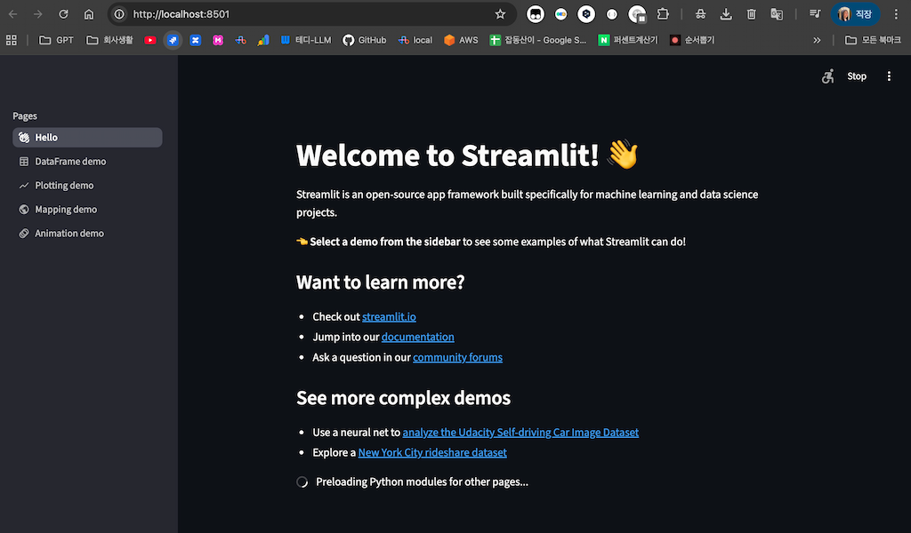
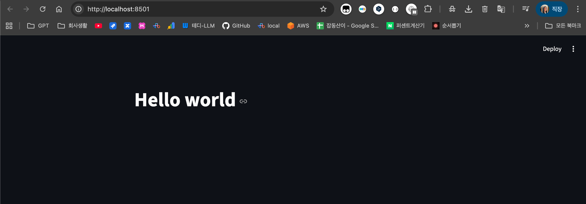

# Streamlit을 활용한 ChatBot 구현 - 1단계

이 문서는 `uv`와 Python 3.13을 사용하여 Streamlit으로 ChatBot을 구현하는 절차를 안내합니다.

## 개발 환경 설정

### 1. 프로젝트 디렉토리 생성

프로젝트를 시작할 디렉토리를 생성하고 해당 디렉토리로 이동합니다.

```bash
mkdir my-streamlit
cd my-streamlit
```

### 2. `uv`로 프로젝트 초기화

`uv`를 사용하여 Python 프로젝트를 초기화합니다. 이 명령은 `pyproject.toml` 파일을 생성하여 프로젝트의 의존성을 관리합니다.

```bash
uv init
```

### 3. Python 가상 환경 생성 및 활성화

프로젝트에 격리된 Python 환경을 설정합니다.

1.  **가상 환경 생성**:
    `uv`를 사용하여 Python 3.13 기반의 가상 환경을 생성합니다. 이 명령은 `.venv` 디렉토리를 생성합니다.

    ```bash
    uv venv --python 3.13
    ```

2.  **가상 환경 활성화**:
    생성된 가상 환경을 활성화하여 프로젝트의 의존성을 사용하도록 셸 환경을 설정합니다.

    - **Mac/Linux**:
      ```bash
      source .venv/bin/activate
      ```
    - **Windows (Command Prompt)**:
      ```bash
      .venv\Scripts\activate.bat
      ```
    - **Windows (PowerShell)**:
      ```bash
      .venv\Scripts\Activate.ps1
      ```

### 4. Streamlit 설치

`uv`를 사용하여 `streamlit` 라이브러리를 설치합니다.

```bash
uv add streamlit
```

### 5. 설치 확인

Streamlit의 예제 앱을 실행하여 설치가 올바르게 완료되었는지 확인합니다.

```bash
streamlit hello
```

브라우저에서 Streamlit 환영 페이지가 열리면 성공적으로 설치된 것입니다. 이제 ChatBot 구현을 시작할 준비가 되었습니다.



### 6. "Hello World" 앱을 만들고 실행 합니다.

1. `app.py` 프로젝트 폴더에 라는 이름의 파일을 만듭니다.

```python
import streamlit as st

st.title("Hello world")
```

2. Streamlit 앱을 실행하세요.

```bash
streamlit run app.py
```


