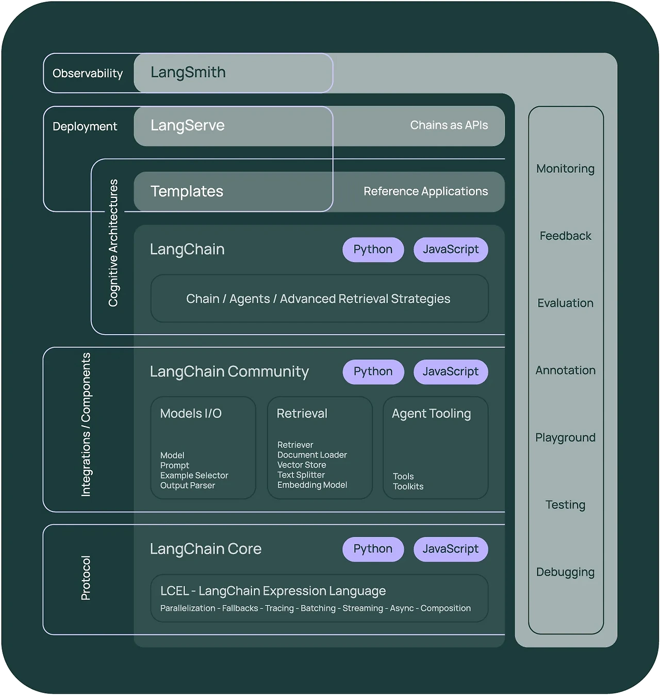
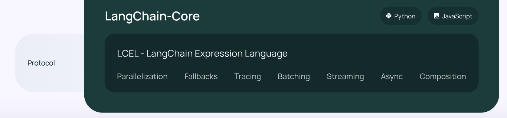
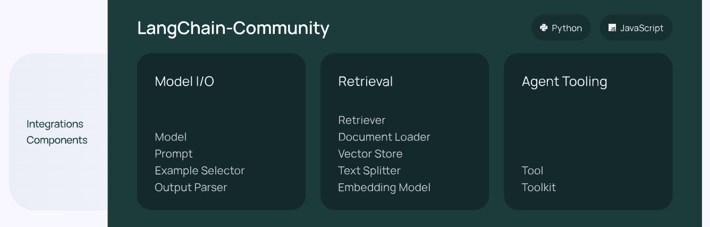
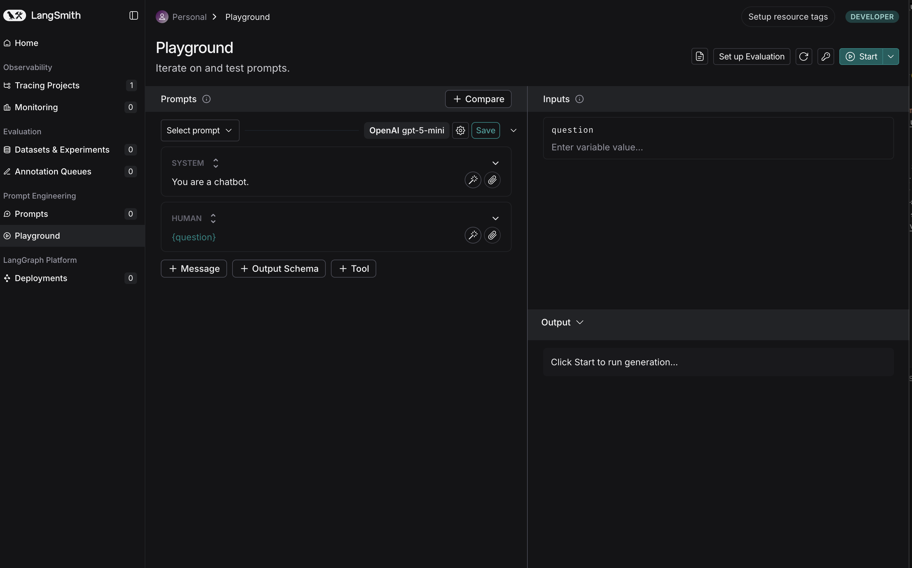

# 2025-09-25 LangChain, LangGrapgh 주요 구성요소



## 랭체인 코어 (langchain-core)

**기본 추상화**: LangChain 프레임워크의 기초를 형성하는 기본 구성 요소들을 제공합니다. 이는 체인, 에이전트, 데이터 변환기 등을 포함합니다.



- **병렬화 (Parallelization)**: 여러 작업을 동시에 처리하여 성능을 최적화합니다.
- **폴백 (Fallbacks)**: 실패 시 대체 경로를 제공하여 안정성을 높입니다.
- **추적 (Tracing)**: 작업의 흐름을 모니터링하고 디버깅할 수 있게 합니다.
- **배칭 (Batching)**: 여러 작업을 하나로 묶어 처리 효율성을 증대시킵니다.
- **스트리밍 (Streaming)**: 실시간 데이터 처리를 지원합니다.
- **비동기 처리 (Async)**: 비동기 작업을 통해 응답성을 향상시킵니다.
- **구성 (Composition)**: 복잡한 작업을 단순하게 결합하여 처리합니다.

<br />

## 랭체인 커뮤니티 (langchain-community)

**서드파티 통합**: 다양한 외부 라이브러리와 도구를 통합하여 LangChain의 기능을 확장



- **모델 I/O (Model I/O)**: 모델, 프롬프트, 예제 선택기, 출력 파서 등의 I/O 작업을 지원합니다.
- **검색 (Retrieval)**: 데이터 검색 및 로딩, 벡터 저장소, 텍스트 분할기, 임베딩 모델 등을 포함합니다.
- **에이전트 도구 (Agent Tooling)**: 도구 및 툴킷을 제공하여 에이전트의 기능을 강화합니다.

```python
from rag.base import RetrievalChain
from langchain_community.document_loaders import PDFPlumberLoader
from langchain_text_splitters import RecursiveCharacterTextSplitter
from typing import List, Annotated


class PDFRetrievalChain(RetrievalChain):
    def __init__(self, source_uri: Annotated[str, "Source URI"]):
        self.source_uri = source_uri
        self.k = 10

    def load_documents(self, source_uris: List[str]):
        docs = []
        for source_uri in source_uris:
            loader = PDFPlumberLoader(source_uri)
            docs.extend(loader.load())

        return docs

    def create_text_splitter(self):
        return RecursiveCharacterTextSplitter(chunk_size=300, chunk_overlap=50)
```

[동영상 강의 샘플코드에 보면 PDF 처리를 langchain_community를 이용하여 처리하고 있음.](https://github.com/teddylee777/langchain-kr/blob/main/17-LangGraph/02-Structures/rag/pdf.py)

## LangSmith



- **개발자 플랫폼**: LLM 애플리케이션의 디버깅, 테스트, 평가, 모니터링을 지원하는 종합적인 개발자 도구를 제공합니다.
  - **디버깅 (Debugging)**: 코드의 오류를 찾아 수정할 수 있는 도구를 제공합니다.
  - **테스트 (Testing)**: 애플리케이션의 기능을 검증할 수 있는 테스트 환경을 제공합니다.
  - **평가 (Evaluation)**: 애플리케이션의 성능을 평가하고 개선할 수 있는 지표를 제공합니다.
  - **모니터링 (Monitoring)**: 애플리케이션의 실시간 상태를 모니터링하고 문제를 조기에 감지할 수 있게 합니다.
- 강의: https://youtu.be/-Jym-zji7YI?si=eidehdvMvpHRh9g8
- Demo: https://smith.langchain.com/
